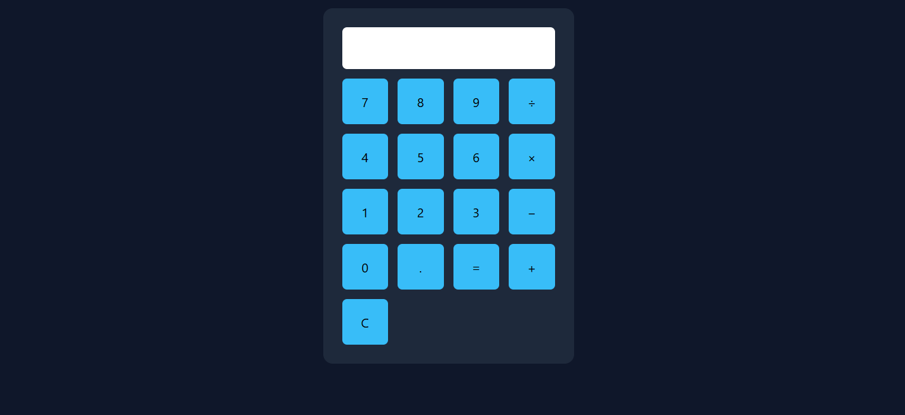

# 🔢 Calculator App - Day 1 Project 26

## 📌 Project Overview

This project is a modern **Calculator App** created as part of my semester challenge to build 200 websites.

It performs basic arithmetic operations using JavaScript and provides an interactive user interface.

---

## 🎯 Features

* 🔢 Numeric Input Buttons (0–9)
* ➕ Arithmetic Operations (+, −, ×, ÷)
* 🧮 Real-time Calculation
* 🧹 Clear Display Button
* 🎨 Clean and Simple UI

---

## 🛠️ Technologies Used

* HTML5
* CSS3
* JavaScript (DOM + Logic)

---

## 📂 Project Structure

```id="k3m8z1"
site-26-calculator/
│
├── index.html
├── style.css
├── script.js
├── preview.png
└── README.md
```

---

## 📸 Preview


---

## 💡 Learning Outcome

* Learned JavaScript logic building
* Practiced event handling
* Built functional web application
* Improved problem-solving skills
* Strengthened Git & GitHub workflow

---

## 🔥 Author

**Yash Patil**
Future Data Engineer 🚀

---

## ⭐ Note

This project is part of my goal to build **200 websites** to improve my web development and design skills.
